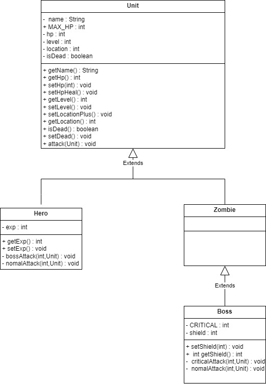
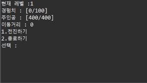

# 다형성 좀비 콘솔게 게임
1. 소개
> 게임에 대한 컨셉 및 플레이 설명

   용사가 전진하면서 몬스터들과 싸우며 레벨업하는 게임입니다.
   전진할시 일정확률로 좀비와 보스를 만날수있습니다.
   적과 조우했을땐 공격/회복 두가지를 선택할수 있습니다.
   좀비를 물리칠시 20exp 보스를 물리칠시 50exp가 상승합니다.
   100exp를 모으면 용사가 레벨업하여 최소공격력이 3상승합니다.
   죽거나 종료할시 스코어가 표시됩니다
  - 스코어는 이동한 거리입니다.
> Class Diagram(UML)

----
> Demo

